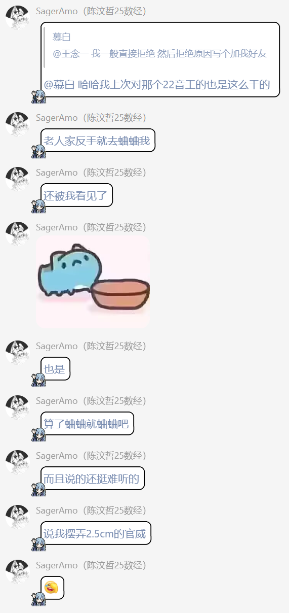
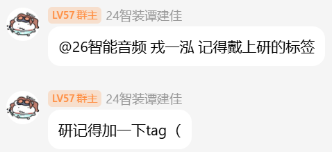
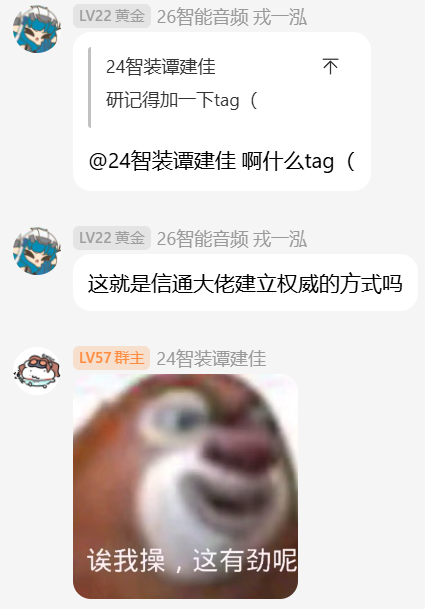
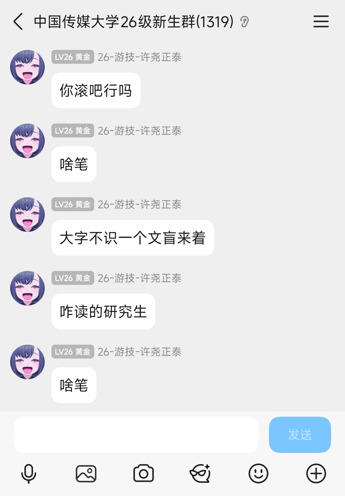
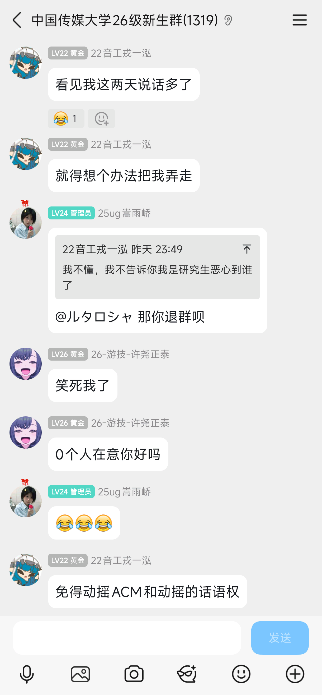
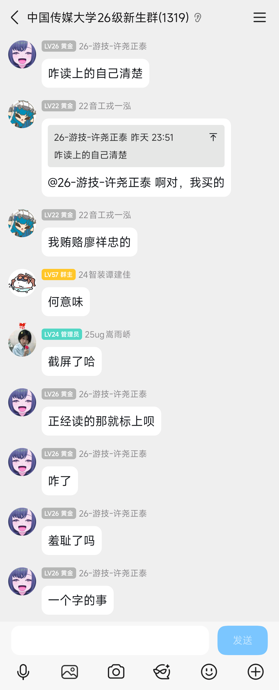
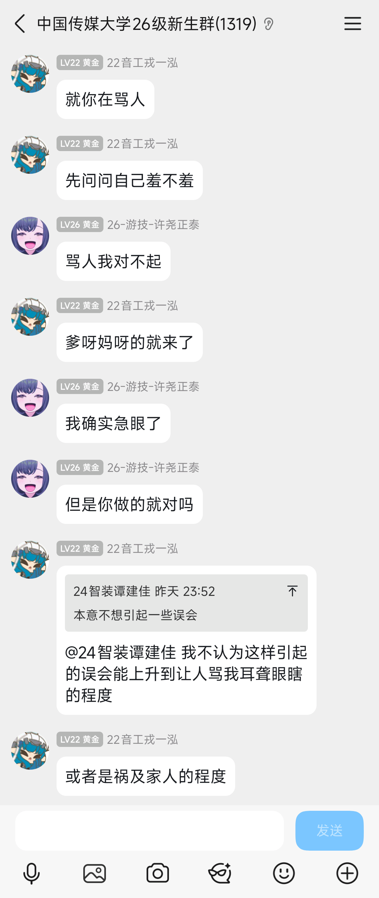
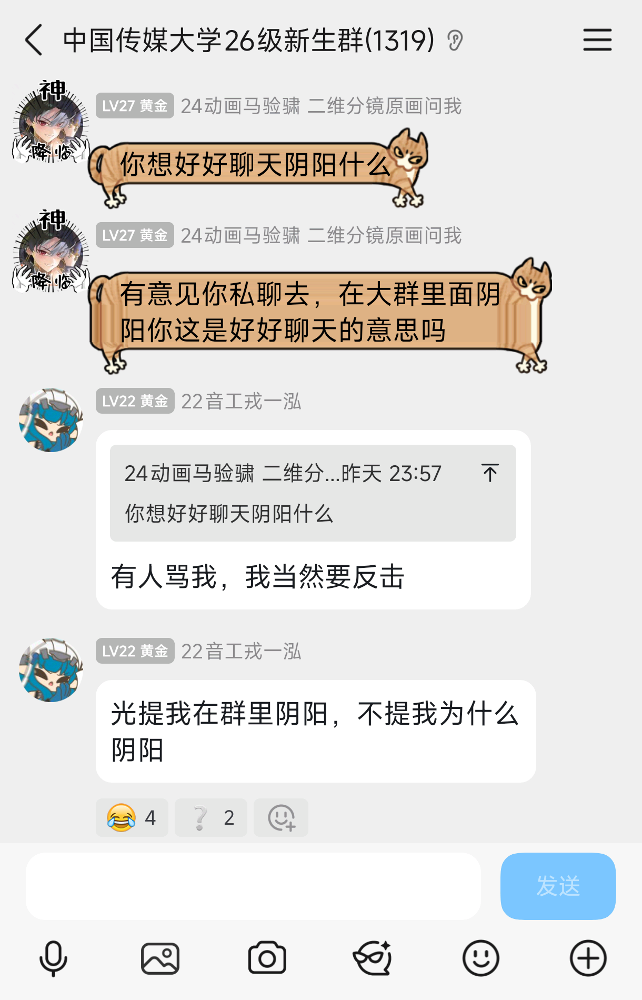
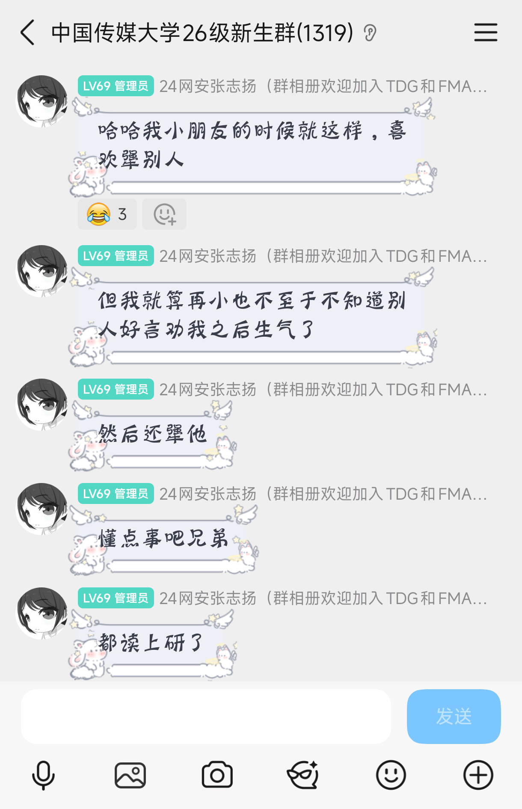
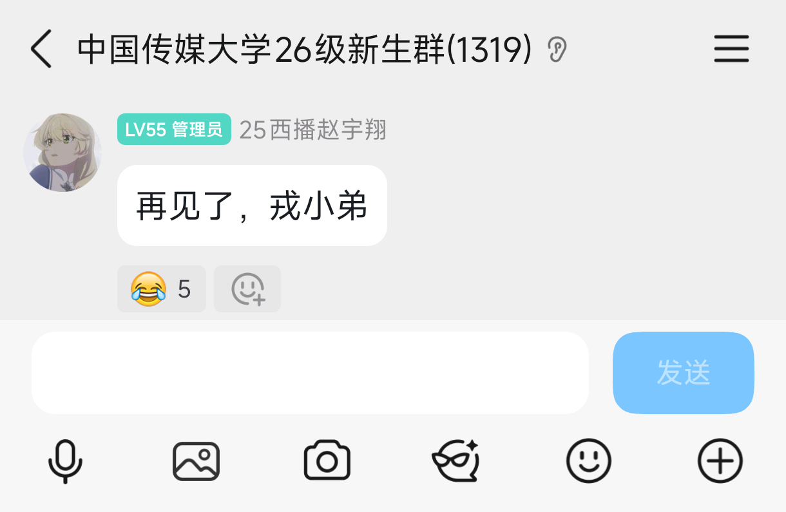

2026 年，<u>戎一泓</u>（前 22 音工）保上了本校的智能音频研究生。
暑假，QQ 26 新生群开放。
七月，戎加入了 QQ 群。

按照时行群规，凡进群者须在群名片中实名标注自己的年级、专业、姓名；如是研究生、预科等亦应标明。

戎入群时标出了常规的三项，而没有标出其研究生身份（如下图）。

时任新生群管的陈汶哲“Amo”（25 数经）在群里提醒他将名片改成公告中要求的格式，却被他在小群蛐蛐。

后来，管理组前后提醒了他四次。
前几次他还会暂时改过去，但过一会便偷偷改回来，后来干脆直接装没看见了。
真是不懂有什么疾病。

9/25 晚，在时任群主<u>谭建佳</u>（24 数媒技）再一次好言好语提醒后，戎选择了阴阳怪气。

这终于点燃了前前前任群主<u>王念一</u>（20 游技）的怒气，战斗一触即发。

最后，戎被踢出群了。

后来，戎又在定福庄传媒群里串，也被踢了。
但这比较无趣，就不记了。