## 前情提要

26导演江再笑，自从加入谢宏鑫的微信新生群后就一直发布豪言豪语，很多人看他不爽但没有当面怼。

## 豪言豪语示例

### "艺考圈子里人尽皆知的秘密"

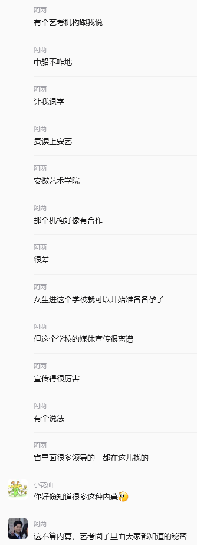
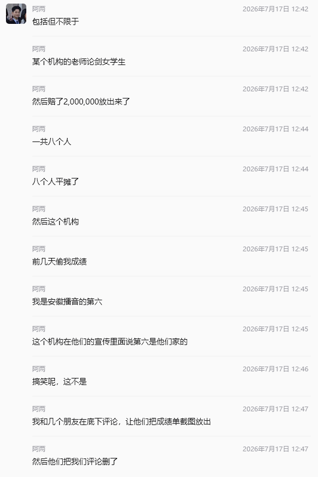

### 招助教

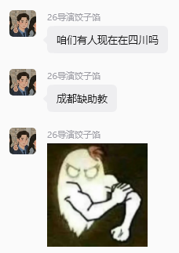
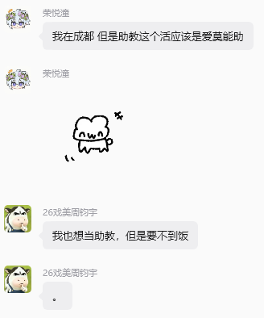
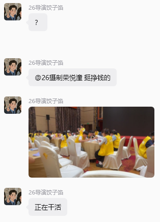
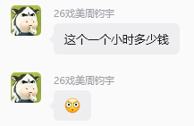
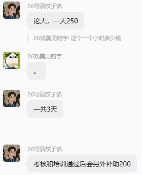
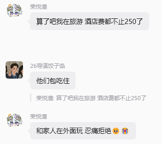

是不是有点幽默了。这个理论上来说算违规发广告，可以直接踢了。

### ？！给给！？

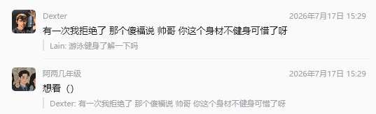

这个其实算不上多豪，但是结合他已经给大家留下来的印象，这条就很显扎眼了。

## 群内风评示例

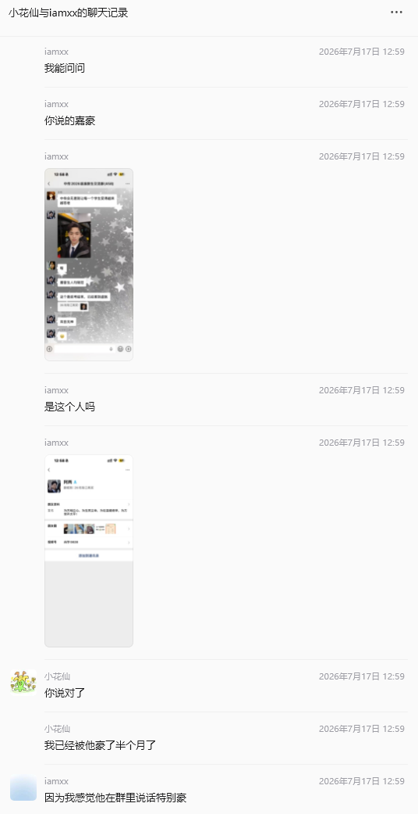

## 转机与挨骂

2026年7月24日星期五傍晚，群里的新生在吐槽今年录取通知书简陋得只有一张纸。大家开始复读"怎么不算藏着传媒之美"这句话，而江突然开启了魔怔模式，讲这句话反复复读了不下十遍。

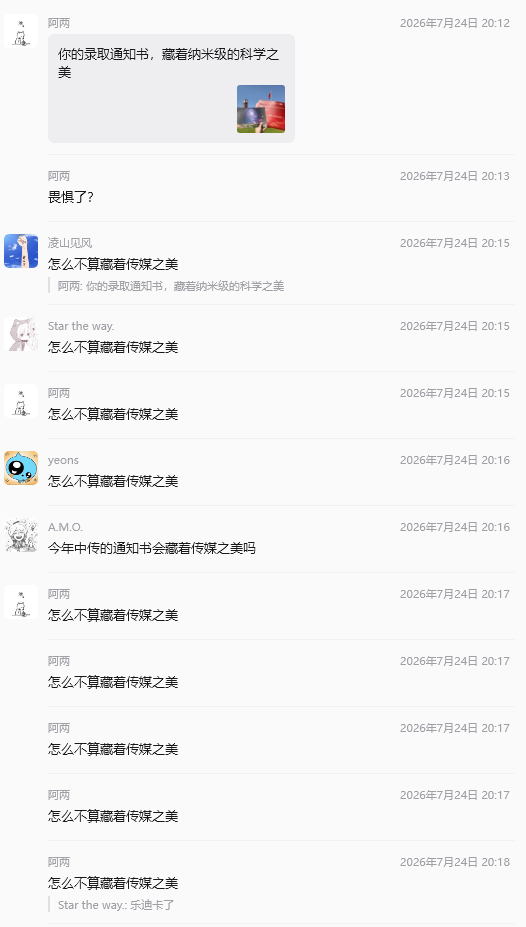
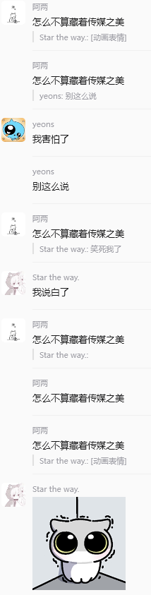

最后，他发了两张低能表情包并再次复读，试图将中传与其形象相关联。

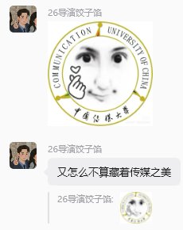
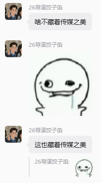

这彻底点燃了王念一的怒火，他当即公屏开骂。

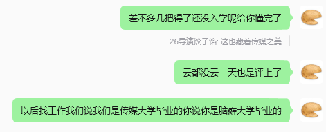

群主谢宏鑫亦出来附和。

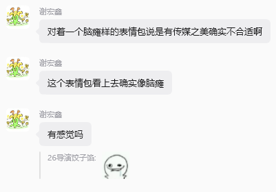

有群友特来加王并赞评之。

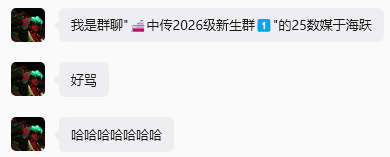
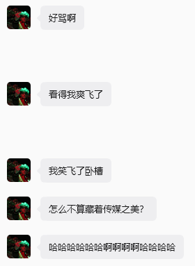

## 后续

被骂后不久，江试图给王、谢私信道歉，虽然他并没有王的微信。

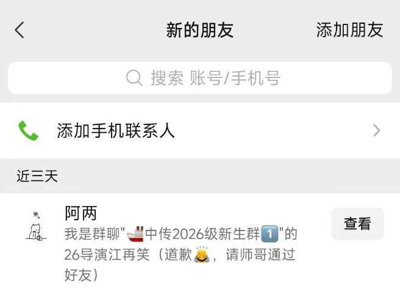
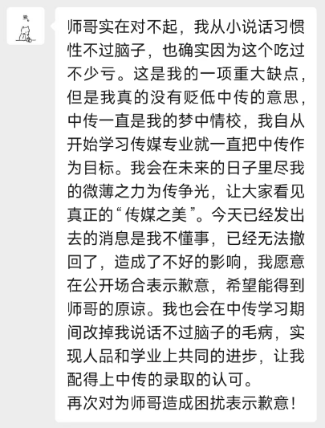

加王的微信不得，他在公屏里喊话：

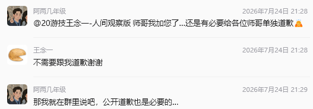
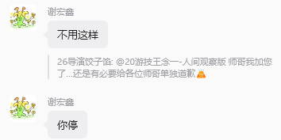

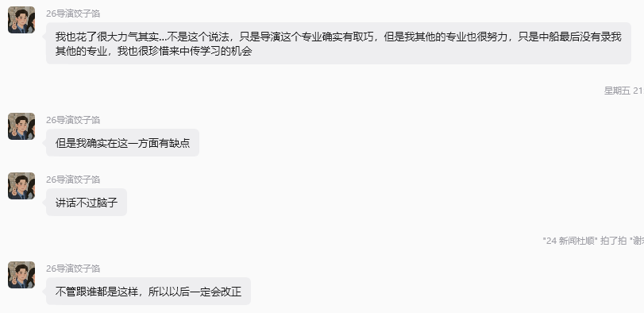

当嘉豪被喷了最好的对策就是噤声，不知这位大导演还在公屏表演是何用意。

所幸他后续大幅减少了在群里的发言频率，也不再豪了。
